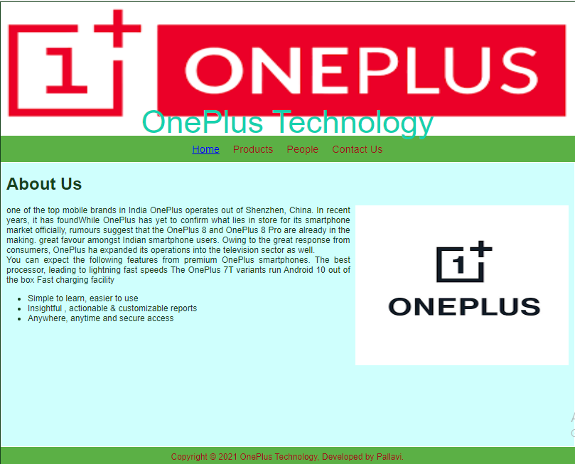
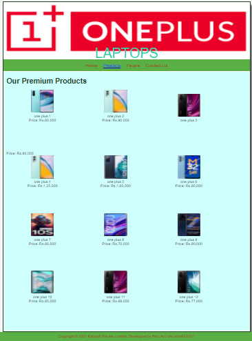
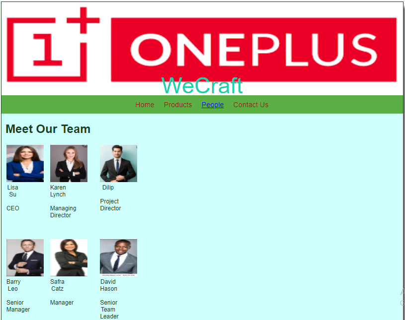
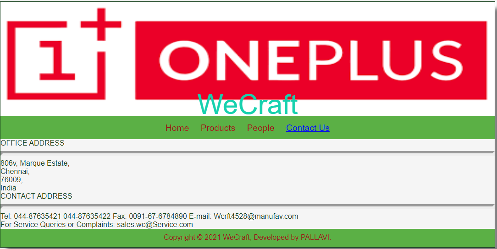

# Web Design for a Software Product Company

## AIM:

To design a static website for a software product company company.

## DESIGN STEPS:

### Step 1:

Requirement collection.

### Step 2:

Creating the layout using HTML and CSS.

### Step 3:

Updating the sample content.

### Step 4:

Choose the appropriate style and color scheme.

### Step 5:

Validate the layout in various browsers.

### Step 6:

Validate the HTML code.

### Step 6:

Publish the website in the given URL.

## PROGRAM :


## OUTPUT:

### Home Page:
```
<!DOCTYPE html>
<html lang="en">
  <head>
    <title>EduSoft Private Limited</title>
    <link rel="stylesheet" href="./css/layout.css" />
    <link rel="icon" href="./img/icon.png" type="image/x-icon" />
  </head>

  <body>
    <div class="container">
      <div class="banner">OnePlus Technology</div>
      <div class="menu">
        <div class="menuitemselected"><a href="/static/home.html">Home</a></div>
        <div class="menuitem"><a href="/static/products.html">Products</a></div>
        <div class="menuitem"><a>People</a></div>
        <div class="menuitem"><a>Contact Us</a></div>
      </div>
      <div class="content">
        <div class="homecontent">
          <h1>About Us</h1>
          
          <div class="contenttext">
            one of the top mobile brands in India OnePlus operates out of Shenzhen, China.
            In recent years, it has foundWhile OnePlus has yet to confirm what lies
            in store for its smartphone market officially,
            rumours suggest that the OnePlus 8 and OnePlus 8 Pro are already in the making. 
            great favour amongst Indian smartphone users.
            Owing to the great response from consumers, OnePlus ha
             expanded its operations into the television sector as well.
            <br />
            You can expect the following features from premium OnePlus smartphones.
            The best processor, leading to lightning fast speeds
            The OnePlus 7T variants run Android 10 out of the box
            Fast charging facility
            <ul>
              <li>Simple to learn, easier to use</li>
              <li>Insightful , actionable & customizable reports</li>
              <li>Anywhere, anytime and secure access</li>
            </ul>
          </div>
        </div>
      </div>
      <div class="footer">
        Copyright &#169; 2021 OnePlus Technology, Developed by Pallavi.
      </div>
    </div>
  </body>
</html>

### PRODUCT PAGE:
<!DOCTYPE html>
<html lang="en">
  <head>
    <title>EduSoft Private Limited</title>
    <link rel="stylesheet" href="./css/layout.css" />
    <link rel="icon" href="./img/icon.png" type="image/x-icon" />
  </head>

  <body>
    <div class="container">
      <div class="banner">LAPTOPS</div>
      <div class="menu">
        <div class="menuitem"><a href="/static/home.html">Home</a></div>
        <div class="menuitemselected">
          <a href="/static/products.html">Products</a>
        </div>
        <div class="menuitem"><a>People</a></div>
        <div class="menuitem"><a>Contact Us</a></div>
      </div>
      <div class="content">
        <div class="productcontent">    
          <h1>Our Premium Products</h1>
          <div class="productitems">
              <div class="productitem"> 
                  <div class="itemimage">
                  
                  </div>
                  <div class="itemname">one plus 1</div>
                  <div class="itemprice">Price: Rs.80,000 </div>
              </div>
              <div class="productitem"> 
                  <div class="itemimage">
                  
                  </div>
                  <div class="itemname">one plus 2</div>
                  <div class="itemprice">Price: Rs.90,000 </div>
              </div>
              <div class="productitem"> 
                <div class="itemimage">
                
                </div>
                <div class="itemname">one plus 3</div>
                </div>
                <div class="itemprice">Price: Rs.90,000 </div>
            </div>
            <div class="productitem"> 
              <div class="itemimage">
              
              </div>
              <div class="itemname">one plus 4</div>
              <div class="itemprice">Price: Rs.1,25,000 </div>
          </div>
          <div class="productitem"> 
            <div class="itemimage">
            
            </div>
            <div class="itemname">one plus 5</div>
            <div class="itemprice">Price: Rs.1,60,000 </div>
        </div>
        <div class="productitem"> 
          <div class="itemimage">
          
          </div>
          <div class="itemname">one plus 6</div>
          <div class="itemprice">Price: Rs.80,000 </div>
      </div>
      <div class="productitem"> 
        <div class="itemimage">
        
        </div>
        <div class="itemname">one plus 7</div>
        <div class="itemprice">Price: Rs.66,000 </div>
    </div>
    <div class="productitem"> 
      <div class="itemimage">
      
      </div>
      <div class="itemname">one plus 8</div>
      <div class="itemprice">Price: Rs.70,000 </div>
  </div>
  <div class="productitem"> 
    <div class="itemimage">
    
    </div>
    <div class="itemname">one plus 9</div>
    <div class="itemprice">Price: Rs.90,000 </div>
</div>
<div class="productitem"> 
  <div class="itemimage">
  
  </div>
  <div class="itemname">one plus 10</div>
  <div class="itemprice">Price: Rs.95,000 </div>
</div>
<div class="productitem"> 
  <div class="itemimage">
  
  </div>
  <div class="itemname">one plus 11</div>
  <div class="itemprice">Price: Rs.89,000 </div>
</div>
<div class="productitem"> 
  <div class="itemimage">
  
  </div>
  <div class="itemname">one plus 12</div>
  <div class="itemprice">Price: Rs.77,000 </div>
</div>
          </div>
          </div>        
      </div>
      <div class="footer">
        Copyright &#169; 2021 EduSoft Private Limited, Developed by PALLAVI VALASAREDDY.
      </div>
    </div>
  </body>
</html>

### PEOPLE PAGE:

<!DOCTYPE html>
<html lang="en">
  <head>
    <title>EduSoft Private Limited</title>
    <link rel="stylesheet" href="./css/layout.css" />
    <link rel="icon" href="./img/icon.png" type="image/x-icon" />
  </head>

  <body>
    <div class="container">
      <div class="banner">LAPTOPS</div>
      <div class="menu">
        <div class="menuitem"><a href="/static/home.html">Home</a></div>
        <div class="menuitemselected">
          <a href="/static/products.html">Products</a>
        </div>
        <div class="menuitem"><a>People</a></div>
        <div class="menuitem"><a>Contact Us</a></div>
      </div>
      <div class="content">
        <div class="productcontent">    
          <h1>Our Premium Products</h1>
          <div class="productitems">
              <div class="productitem"> 
                  <div class="itemimage">
                  
                  </div>
                  <div class="itemname">one plus 1</div>
                  <div class="itemprice">Price: Rs.80,000 </div>
              </div>
              <div class="productitem"> 
                  <div class="itemimage">
                  
                  </div>
                  <div class="itemname">one plus 2</div>
                  <div class="itemprice">Price: Rs.90,000 </div>
              </div>
              <div class="productitem"> 
                <div class="itemimage">
                
                </div>
                <div class="itemname">one plus 3</div>
                </div>
                <div class="itemprice">Price: Rs.90,000 </div>
            </div>
            <div class="productitem"> 
              <div class="itemimage">
              
              </div>
              <div class="itemname">one plus 4</div>
              <div class="itemprice">Price: Rs.1,25,000 </div>
          </div>
          <div class="productitem"> 
            <div class="itemimage">
            
            </div>
            <div class="itemname">one plus 5</div>
            <div class="itemprice">Price: Rs.1,60,000 </div>
        </div>
        <div class="productitem"> 
          <div class="itemimage">
          
          </div>
          <div class="itemname">one plus 6</div>
          <div class="itemprice">Price: Rs.80,000 </div>
      </div>
      <div class="productitem"> 
        <div class="itemimage">
        
        </div>
        <div class="itemname">one plus 7</div>
        <div class="itemprice">Price: Rs.66,000 </div>
    </div>
    <div class="productitem"> 
      <div class="itemimage">
      
      </div>
      <div class="itemname">one plus 8</div>
      <div class="itemprice">Price: Rs.70,000 </div>
  </div>
  <div class="productitem"> 
    <div class="itemimage">
    
    </div>
    <div class="itemname">one plus 9</div>
    <div class="itemprice">Price: Rs.90,000 </div>
</div>
<div class="productitem"> 
  <div class="itemimage">
  
  </div>
  <div class="itemname">one plus 10</div>
  <div class="itemprice">Price: Rs.95,000 </div>
</div>
<div class="productitem"> 
  <div class="itemimage">
  
  </div>
  <div class="itemname">one plus 11</div>
  <div class="itemprice">Price: Rs.89,000 </div>
</div>
<div class="productitem"> 
  <div class="itemimage">
  
  </div>
  <div class="itemname">one plus 12</div>
  <div class="itemprice">Price: Rs.77,000 </div>
</div>
          </div>
          </div>        
      </div>
      <div class="footer">
        Copyright &#169; 2021 EduSoft Private Limited, Developed by PALLAVI VALASAREDDY.
      </div>
    </div>
  </body>
</html>

### CONTACT US PAGE:
<!DOCTYPE html>
<html lang="en">
  <head>
    <title>WeCraft</title>
    <link rel="stylesheet" href="./css/layout.css" />
    <link rel="icon" href="./img/icon.png" type="image/x-icon" />
  </head>

  <body>
    <div class="container">
      <div class="banner">WeCraft</div>
      <div class="menu">
        <div class="menuitem"><a href="/static/home.html">Home</a></div>
        <div class="menuitem">
          <a href="/static/products.html">Products</a>
        </div>
        <div class="menuitem"><a href="/static/people.html">People</a></div>
        <div class="menuitemselected"><a href="/static/contactus.html">Contact Us</a></div>
      </div>
      <div class="contactus" background-image="url(/static/img/cbg.jpg")>
          OFFICE ADDRESS <br>
          <hr style="height:2px;border-width:5px;color:#e6752f;background-color: #e6752f">
          
          806v, 
          Marque Estate,<br>
          Chennai,<br>
          76009,<br>
          India<br>

          CONTACT ADDRESS<br>
          <hr style="height:2px;border-width:5px;color:#e6752f;background-color: #e6752f">
          
          Tel: 044-87635421
               044-87635422
          Fax: 0091-67-6784890
          E-mail: Wcrft4528@manufav.com
          <br>
           For Service Queries or Complaints: sales.wc@Service.com
        
        </div>
        <div class="footer">
            Copyright &#169; 2021 WeCraft, Developed by PALLAVI.
          </div>

      </div>
      </body>
      </html>

```      
## OUTPUT:      
### HOME PAGE:  



### PRODUCT PAGE:



### PEOPLE PAGE:



### CONTACT US PAGE:


```

## Result:

Thus a website is designed for the software product company and the HTML,CSS code are validated.
